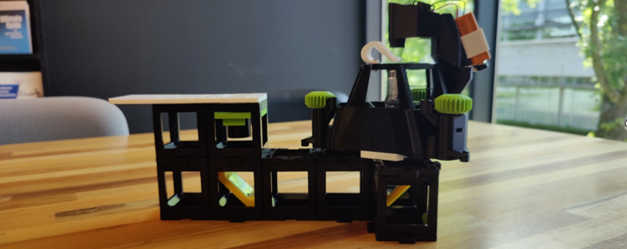

# Openflexure Documentation

Mechanical version of the delta stage with tweaks for better usability. The original version requires feet and rubber bands to force the stage down. This is not required but recommmended! In combination with the UC2 cubes the feet do not fit, so an smaller adjusted version was made. The delta stage can be used in combination with the UC2 system. On the bottom an (now adjusted) connector part is used. For the main unit it is important to print without an brim! There is a version with a smart brim built into the file, this works too. (See openflexure.org)  

 There are 2 options: using the original LED module, adjusted to hold a 9V battery or using UC2 cubes on top. Make sure not to add too many cubes on top as vibrations could become an issue.  

# Part List

## Manual Mechanical Version:
This folder contains STL files for the manual mechanical version of the project. These files include components designed for manual operation, with redesigned knobs for easier use. Print these files for the non-motorized version of the project.
- `delta_stage_remaster.stl`
- `feet_lowprofile_uc2.stl`
- `Knob [3x].stl`
- `OpticalLense_Adapter_CUSTOM.stl`
- `OpticalLense_Adapter.stl`
- `Small_Knob.stl`

## Motorized Version:
This folder contains STL files for the motorized version of the project. These files are designed to be used with motors for automated operation. Ensure proper assembly and alignment of motorized components for optimal functionality.
- `delta_stage_remaster.stl`
- `feet_lowprofile_uc2.stl`
- `Knob [3x].stl`
- `large_gears.stl`
- `OpticalLense_Adapter_CUSTOM.stl`
- `OpticalLense_Adapter.stl`
- `Small_Knob.stl`
- `Small_gears.stl`

## UC2 Connection:
This folder contains files related to the connection between the Delta Stage and UC2 blocks. These components ensure a secure and stable connection between these elements.
- `UC2-Bottom-Connector.stl`
- `UC2-Top-Connector.stl`

## Optional Parts:
This folder contains additional optional components that can be used based on specific project requirements.

- **Actuator Assembly Tools:**
  - **File:** `Actuator_assembly_tools.stl`
  - **Description:** Tools designed to assist in the assembly rubber bands, see openflexure.org deltastage manual for more tips.
- **LED Components:**
  - **File:** `LED_9vClip_plain.stl`
  - **File:** `LED_condensor.stl`
  - **File:** `LED_illumination_dovetail.stl`
  - **Description:** These files represent various components related to LED illumination in the project. Use them as needed for your specific lighting requirements.
- **Sample Clips:**
  - **File:** `sample_clips.stl`
  - **Description:** Clips designed for specific applications within the project. Use them for securing components as required.

## Printing and Assembly Instructions:
Please follow these guidelines for 3D printing and assembly:

1. **3D Printing:**
   - Use PLA or ABS filament based on your preference and printer compatibility. For components directly used with a lense, such as `OpticalLense.stl` parts, print in Black. 
   - Ensure proper bed adhesion and avoid warping issues during printing.
   - Print with support for intricate parts as needed.

2. **Assembly:**
   - Carefully assemble the components, ensuring precise alignment.
   - For the motorized version, integrate motors according to the provided motor mounting guidelines.
   - Lubricate moving parts if necessary for smooth operation.
   - Verify that all components fit together securely.

## Notes:
- Verify the compatibility of motorized components with your chosen motors and power supply.
- Test the functionality of moving parts and connections before finalizing the assembly.
- For any questions or issues, refer to the project documentation or contact the project team for assistance.

## Change Log:
- Redesigned main knobs for easier mechanical use.
- Added fourth knob for adjustable objective lens height, eliminating the need for screwdrivers. Improved grip for precise adjustments.
- Adjusted main stage for smooth movement of the fourth knob, especially when using the delta stage with the extra part for the simple LED module.
- Designed a battery holder for the simple LED module, manually glued with plastic glue for better orientation. Use white LED.
- Modified tolerance of UC2 and Delta Stage adapter holes in PLA for a better fit (tried ABS but faced inconsistent warping). Outer parts are slightly loose to prevent excess tension on the cubes. Print with support and the largest part on the bottom.
- Created UC2 delta stage adapter for the top part.
- Adjusted objective lens height due to the added UC2 Delta Stage adapter height. Nut placement shifted to the bottom. Enhanced moveability in the Delta stage itself. Original LED module attachment is optional. Knobs for motors are retained but unused.