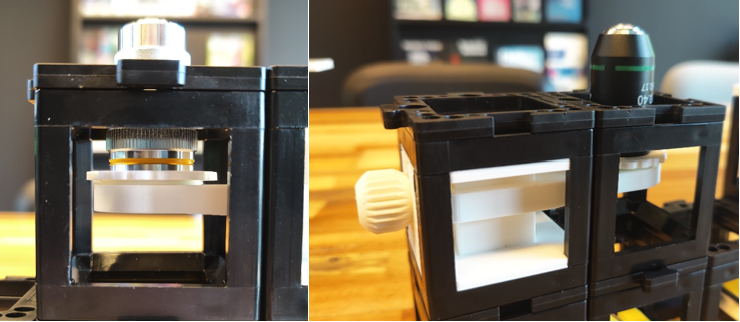
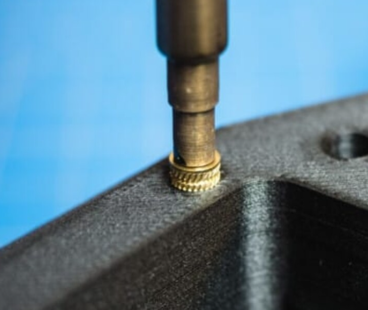
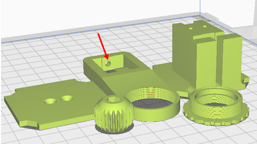
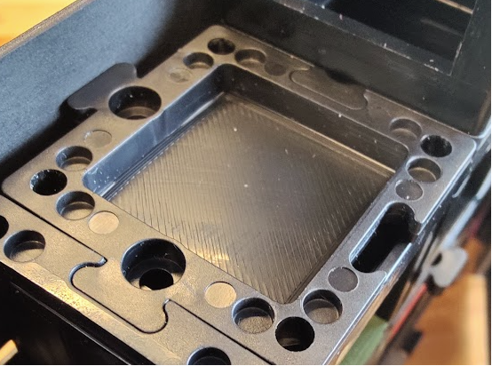
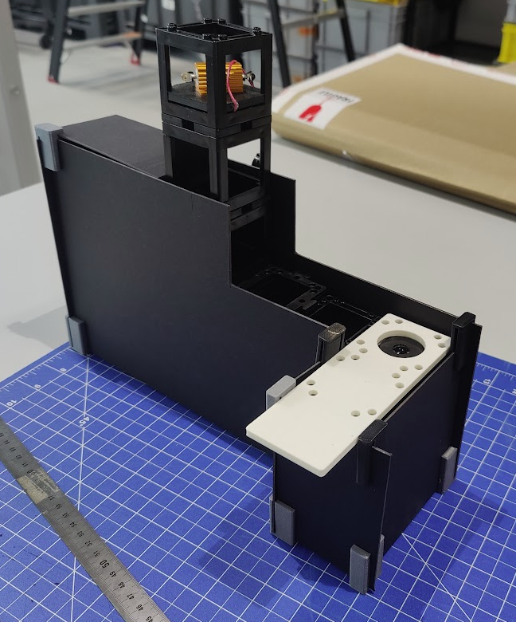

# UC2 Add-ons and Custimizations

### Z-Stage
  
The original Z-stage https://github.com/openUC2/UC2-GIT/tree/master/CAD/ASSEMBLY_CUBE_Z-STAGE_mechanical is relatively prone to breaking. The manual knob was often very hard to use, therefore the z-stage was redesigned. It requires 2 cubes of space and has two adjustments. A large rough adjustment, by sliding the whole part up or down and tightening with the knob. The objective lense is screwed into a printed screw. The printed part can be rotated for fine adjustments. Printing in ABS has nicer tolerances, especially for the screw part. A combination of all PLA but screw in ABS or the other way around also works nicely. 
With the redesigned manual Z-stage a simple smartphone microscope is built for verification. See https://uc2configurator.netlify.app/ APP_SIMPLE-Smartphone_Microscope  

#Heat Inserts
Heat inserts make sure that you can tighten the design for more than once, when only using abs or pla it can quickly be overturned. To ensure longevity of the design heat inserts are used.
Never used heat inserts? Then continue reading… The screw hole at the red arrow in figure 5 is designed for an brass heat insert. 
The brass heat inserts can be pushed into the design from outside into the print with a soldering iron. Makes sure that the insert is straight, you can make sure it is by inserting a long bolt and reapplying heat and straightening the bolt. 
M3 heat inserts are used. They exist in several lengths, they should not be longer than 5.5 [mm]. The Hole is a little bit larger 3.5mm to make sure they fit but do not have excess material pushed into the design. It should be flush with the outside of the print.  

    
    

## Insert for Light-Sensitive Setups:
The light-sensitive setup includes a specialized insert designed to block external light sources and prevent light leakage during fluorescence microscopy. Open the cube to insert the 3d printed part. This was designed and tested with ABS, PLA results may vary due to different tolerances. Also depends on the used setup and printer. 

## Cardboard Enclosure
The microscope setup includes a custom cardboard enclosure that provides protection and stability for the components. Follow the instructions below for cutting and assembling the cardboard enclosure:

### Assembly Steps:
1. **Cutting the Cardboard:**
   - Depending on your setup measure and draw out the different pieces required to enclose your setup.
   - Ensure precise cutting for accurate fitting of the enclosure components.

2. **Corner Piece Connection:**
   - Use the 3D printed corner pieces to connect the cardboard panels securely.
   - Align the corner pieces with the corresponding corners of the cardboard pieces.
   - Insert the cardboard edges into the slots of the corner pieces.

3. **Setup the Microscope:**
   - Place the microscope inside the assembled cardboard enclosure, ensuring it fits snugly and is properly centered. It might be required to first insert the microscope setup while assembling the cardboard pieces.

4. **Use inserts in critical places:**
   - The insert cover discussed in the previous paragraph might be required in the inside of the microscope since the setup often requires sample and laser to be quite close. 

